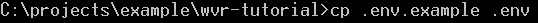
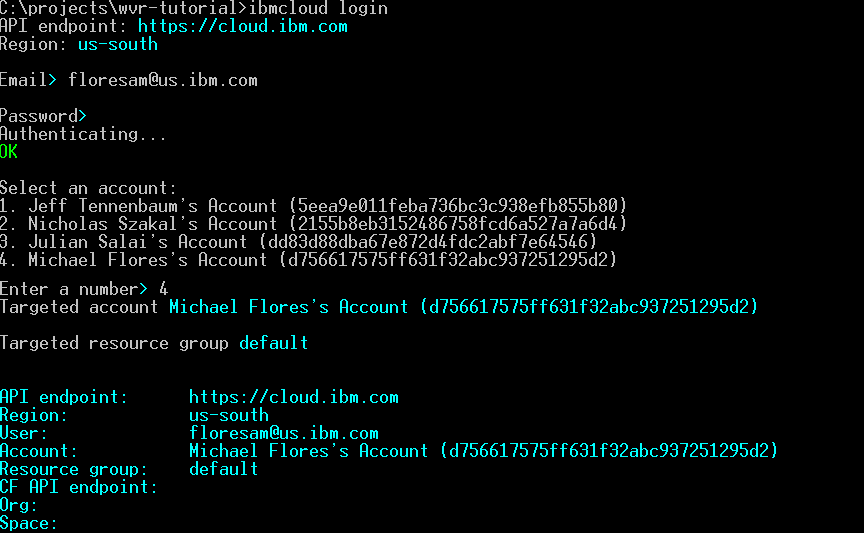

# Integrating a Custom Watson Visual Recognition Model into an application
### Written by Michael Flores, IBM
This tutorial will show you how to create a node.js application that uses a custom Watson Visual Recognition Model. We assume that you have already created a custom Watson Visual Recognition Model as shown in this [tutorial](https://developer.ibm.com/tutorials/detect-wildfire-damaged-homes-using-drone-images-watson-visual-recognition/). You will need the `MODEL_ID` of your custom model.

1. Download this repository by using the git clone command in your terminal or git IDE of choice.  
```git clone https://github.com/floresam/wvr-tutorial.git```  

2. Navigate to the repository's root directory (wvr-tutorial).  
```cd wvr-tutorial```   

3. Copy the `.env.example` file to a new file called `.env` .  
```cp .env.example .env```  

4. In the `.env` file, provide your Watson Visual Recognition API key and your custom model id as shown below  
```
# Environment variables
VISUAL_RECOGNITION_IAM_APIKEY=YOUR_VISUAL_RECOGNITION_APIKEY_KEY_GOES_HERE
OVERRIDE_CLASSIFIER_ID=YOUR_CUSTOM_MODEL_ID_GOES_HERE
```

## Running the application locally
1. From the wvr-tutorial directory, run `npm install` to install the node.js modules required to run the program. 
   
2. From the wvr-tutorial directory, run `npm start` to start the application.  


## Running the application on IBM Cloud
1. To deploy the code to IBM cloud, you will need to install the IBM Cloud Command Line Interface(CLI) which is accessed via the `ibmcloud` command. The IBM Cloud CLI can be downloaded [here](https://cloud.ibm.com/docs/cli?topic=cloud-cli-install-ibmcloud-cli).
2. Run `ibmcloud login` to log into IBM Cloud via the CLI. Ensure that you select the account and region that you created your Watson Visual Recognition service in (us-south is the default).

  1. If you have multiple Cloud Foundry (CF) orgs & spaces in your account, you will need to run `ibmcloud target --cf` to interactively set the org & space where your application will be deployed to.

3. From the wvr-tutorial directory, run `ibmcloud cf push` to deploy the application to IBM Cloud. This will use the settings present in the `manifest.yml` file. Sample output is below:

  1. When the command successfully completes, you will see the below message which provides details on your applications IBM Cloud deployment status.  
